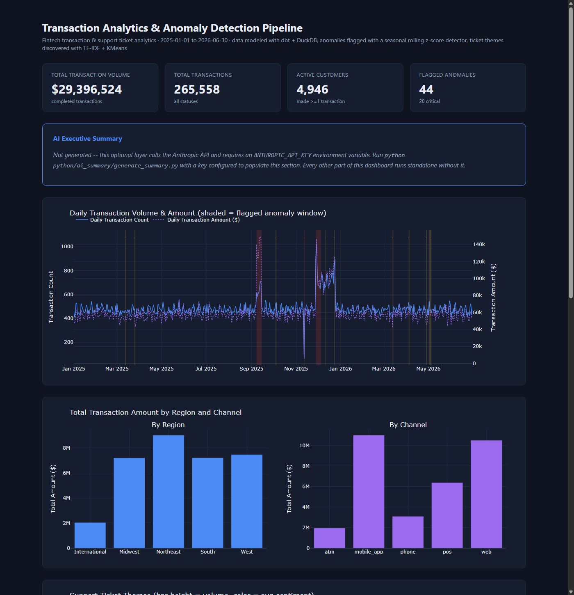
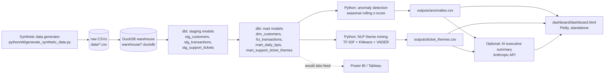

# Transaction Analytics & Anomaly Detection Pipeline

An end-to-end analytics engineering project for a simulated fintech company: synthetic transaction and support-ticket data, modeled in a warehouse with dbt, mined for time-series anomalies and text themes in Python, and surfaced in an interactive dashboard.

It's built to demonstrate the full analyst/analytics-engineer toolkit on one dataset — SQL data modeling, Python analysis, and BI — rather than a single notebook doing everything in one place.



## Why this matters (business framing)

A payments company loses money two ways it can actually act on: **fraud and outages it doesn't catch fast enough**, and **customers it frustrates without noticing**. This project simulates both signals and a pipeline to catch them:

- **Transaction monitoring** — a lightweight statistical monitor that flags unusual volume, dollar amount, and decline-rate patterns by region and channel, the kind of signal a fraud/ops team would want surfaced automatically rather than discovered days later in a monthly report.
- **Support ticket mining** — unsupervised clustering of ticket text into themes with sentiment scoring, so a support/product team can see *what* customers are complaining about and *how negatively*, without reading three thousand tickets by hand.
- Both are tied together in one dashboard a non-technical stakeholder could open and understand in under a minute.

## Architecture



DuckDB stands in for Snowflake here so the whole thing runs locally with no cloud account or credentials — see [Porting to production](#porting-to-production-snowflake--power-bi--tableau) for exactly what changes to run this for real.

## Repo layout

```
data/                      synthetic CSVs (customers, transactions, support_tickets)
python/etl/                data generation + warehouse loading
dbt/transaction_analytics/ dbt project (staging -> marts, tests, docs)
python/anomaly_detection/  time-series anomaly detection over the marts
python/nlp/                TF-IDF + KMeans theme clustering, VADER sentiment
python/ai_summary/         optional Anthropic API executive summary
python/dashboard/          builds the standalone dashboard.html
outputs/                   anomalies.csv, ticket_themes.csv, ticket_sentiment.csv
dashboard/dashboard.html   the final interactive dashboard (open directly, no server)
warehouse/                 local DuckDB file (gitignored, regenerated by the pipeline)
docs/screenshots/          dashboard screenshots for this README
```

## Tech stack

| Layer | Tool | Notes |
|---|---|---|
| Synthetic data | pandas, numpy, Faker | seeded (`SEED=42`) for reproducibility |
| Warehouse | DuckDB | stands in for Snowflake, see below |
| Modeling | dbt-core + dbt-duckdb | staging + marts, schema tests, docs |
| Anomaly detection | pandas, numpy | seasonal rolling z-score |
| NLP | scikit-learn (TF-IDF, KMeans), vaderSentiment | unsupervised theme clustering + sentiment |
| Dashboard | Plotly | static, standalone HTML — no server, stands in for Power BI/Tableau |
| Optional AI layer | Anthropic API (`claude-sonnet-4-6`) | reads `ANTHROPIC_API_KEY` from env, never hardcoded |

## Setup

```bash
python -m venv venv
# Windows
venv\Scripts\activate
# macOS/Linux
source venv/bin/activate

pip install -r requirements.txt
```

## Running the pipeline

Run these in order from the repo root:

```bash
# 1. Generate synthetic data (5k customers, ~250k-265k transactions, ~2.9k tickets)
python python/etl/generate_synthetic_data.py

# 2. Load raw CSVs into DuckDB (warehouse/transaction_analytics.duckdb)
python python/etl/load_to_duckdb.py

# 3. Run dbt: staging views + mart tables + schema tests
cd dbt/transaction_analytics
dbt build --profiles-dir .
dbt docs generate --profiles-dir .   # optional: browsable model docs
cd ../..

# 4. Time-series anomaly detection -> outputs/anomalies.csv
python python/anomaly_detection/detect_anomalies.py

# 5. NLP theme mining + sentiment -> outputs/ticket_themes.csv, outputs/ticket_sentiment.csv
python python/nlp/analyze_tickets.py

# 6. Optional: AI executive summary (skips gracefully if ANTHROPIC_API_KEY is unset)
export ANTHROPIC_API_KEY=sk-...   # optional
python python/ai_summary/generate_summary.py

# 7. Build the dashboard -> dashboard/dashboard.html
python python/dashboard/build_dashboard.py
```

Then open `dashboard/dashboard.html` directly in a browser — it's a single static file with Plotly.js embedded inline, so it works fully offline.

> **Note on this environment:** `scikit-learn` (used in step 5) imports a compiled SVM DLL that some Windows Application Control / sandboxed shells block when launched from certain shells. If step 5 fails with a `DLL load failed` error from a Bash/Git-Bash shell, run it from PowerShell or a plain `cmd.exe` instead — it's an OS-level DLL-loading policy issue, not a code or dependency problem.

## Key findings

The pipeline recovers all three anomaly patterns baked into the synthetic data generator — and the detector has no knowledge of those injected constants; it only sees the aggregated daily KPIs and flags statistical outliers against a seasonal baseline.

- **Fraud spike, West region, 2025-09-08 to 2025-09-14**: West-region transaction volume peaked at 251/day (+157% vs. baseline, z=26.2) alongside an elevated decline rate, and system-wide dollar volume peaked at $132,692/day (+137%, z=27.3) over the same week — the detector's own heuristic labels this a "fraud attempt or attack concentrated in this region." Support tickets corroborate it: 60 `fraud_report` and 29 `failed_transaction` tickets were filed in that single week, versus a normal week's baseline of a handful.
- **Processing outage, 2025-11-12**: system-wide transaction volume collapsed to 65 for the day (-86% vs. baseline, z=-8.2), and the drop shows up independently in every region and channel series that day (Northeast z=-17.8, mobile_app z=-12.0, phone z=-13.3). Ticket volume spiked in response: 51 `failed_transaction` and 16 `slow_support` tickets landed in the surrounding 3 days.
- **Holiday demand surge, 2025-11-28 to 2025-12-24**: system-wide dollar volume peaked at $146,693/day (+135%, z=15.0) in the Black Friday/Christmas window, spread broadly across every region (Northeast +107%, West +107%, Midwest +93%) rather than concentrated in one — the shape the detector uses to distinguish "broad demand surge" from a regional fraud event.
- **44 anomaly events** were flagged in total (20 critical / 10 high / 14 medium) across ~18 months of daily data; 8 of the 14 "medium" events are isolated one-day blips in the lowest-volume segments (the International region, phone/atm channels), which is the expected false-positive behavior of a z-score detector on thin daily samples — noted here rather than hidden, since a real monitoring system would have the same limitation.
- **Unsupervised ticket clustering recovered the human-assigned categories almost exactly**: TF-IDF + KMeans (k=8, chosen by silhouette score) produced 8 clusters with **100% category purity** each — e.g. the cluster whose top terms are "failed / declined / transaction / payment" is 100% `failed_transaction` tickets. Sentiment scoring lines up with intuition: `positive_feedback` averages +0.94, `failed_transaction` averages -0.78, and `fraud_report` averages -0.24 (angry but often relieved-sounding once support responds).
- The **failed-transaction and fee-complaint themes are the largest and most negative** (558 and 445 tickets, sentiment -0.78 and -0.36) — the clearest candidates for a product/support team to prioritize.

## Data model (dbt)

```
raw.customers, raw.transactions, raw.support_tickets      (loaded by python/etl/load_to_duckdb.py)
        |
        v
stg_customers, stg_transactions, stg_support_tickets       (staging: typed, cleaned, 1:1 with raw)
        |
        v
dim_customers            customer dimension + lifetime txn/ticket activity
fct_transactions          transaction fact table (grain: 1 row per transaction)
mart_daily_kpis            daily volume/amount/declines by region + channel -- feeds anomaly detection
mart_support_ticket_themes  daily ticket volume by category -- SQL-level complement to the Python NLP clusters
```

7 models total, with `not_null` / `unique` / `accepted_values` / `relationships` schema tests on every key column (49 tests, all passing) and full column-level descriptions in `schema.yml` for `dbt docs generate`.

## Anomaly detection method

**Seasonal rolling z-score.** The data has real weekly seasonality (weekend lift), so a naive trailing-window mean/std would misfire every weekend. Instead, each day is compared only to the same day-of-week over its preceding 10 occurrences ("the last 10 Mondays"), which cancels out the weekly pattern and isolates genuine regime shifts. This is a lighter-weight alternative to STL decomposition that's easy to reason about with ~18 months of daily data.

Consecutive flagged days for the same metric/region are consolidated into a single event (anchored on the peak day) rather than emitted as one noisy row per day, and plain-English descriptions are generated from heuristics over the flagged pattern itself (single-day system-wide drop → "outage-like"; regional volume spike + elevated decline rate → "fraud-like"; broad multi-region increase → "demand surge") — not from the injected event labels.

## NLP method

TF-IDF vectorization (unigrams + bigrams, `min_df=5`, `max_df=0.5`) over ticket subject + body, then KMeans with `k` chosen by silhouette score search over `k=5..10`. Each cluster is labeled with its top terms by centroid weight. VADER sentiment (compound score) is computed per ticket independently of the clustering. The ground-truth `category` field from the generator is used *only* after clustering, to report how well the unsupervised themes line up with what a human labeled — it is never fed into the vectorizer or the clustering itself.

## Porting to production (Snowflake + Power BI / Tableau)

Everything here is written to port with minimal changes:

- **Warehouse**: swap the `dbt-duckdb` adapter for `dbt-snowflake` in `requirements.txt`, and point `dbt/transaction_analytics/profiles.yml` at a Snowflake account/warehouse/database/schema instead of a local file path. No model SQL needs to change — the staging/marts SQL avoids DuckDB-specific syntax.
- **Ingestion**: `python/etl/load_to_duckdb.py` (a local CSV loader) would be replaced by whatever lands raw data in Snowflake in production — Fivetran/Airbyte, `COPY INTO`, or an orchestrated Snowpipe — landing into the same `raw.*` schema the dbt sources already expect.
- **BI layer**: `main_marts.mart_daily_kpis`, `dim_customers`, `fct_transactions`, and `mart_support_ticket_themes` are exactly the tables you'd point Power BI or Tableau at via a live Snowflake connection — the Plotly dashboard here exists because Power BI/Tableau aren't scriptable in this environment, not because the data isn't ready for them.
- **Orchestration**: in production, steps 1-7 above would run as an Airflow/Dagster/dbt Cloud job on a schedule instead of a manual script sequence.

## Optional AI executive summary

`python/ai_summary/generate_summary.py` sends the top flagged anomalies and ticket themes to the Anthropic API (`claude-sonnet-4-6`) and asks for a 3-5 sentence executive summary, which gets embedded in the dashboard. It reads `ANTHROPIC_API_KEY` from the environment only — never hardcoded, never committed (see `.gitignore`) — and if the key isn't set, it prints a message and exits cleanly so the rest of the pipeline is completely unaffected. This is intentionally a secondary/optional layer, not something the core pipeline depends on.
